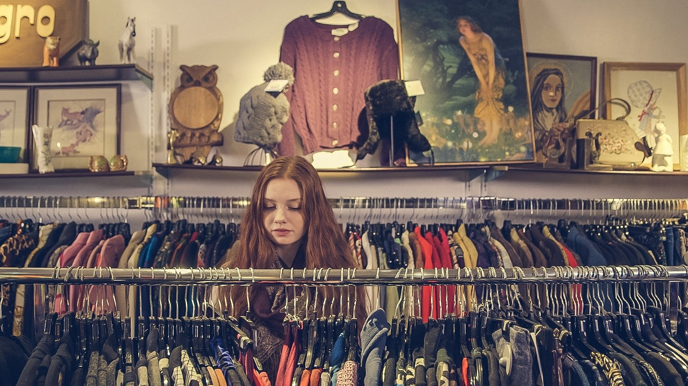
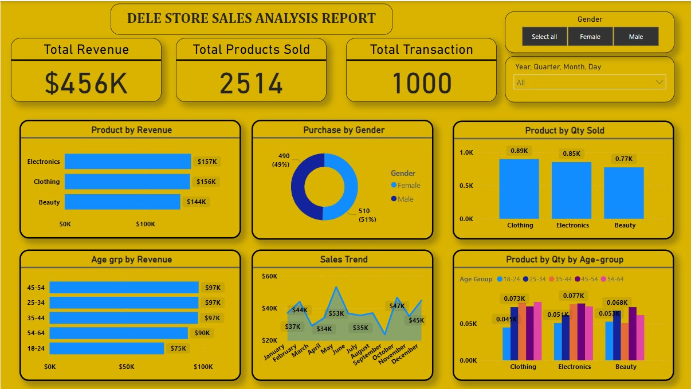
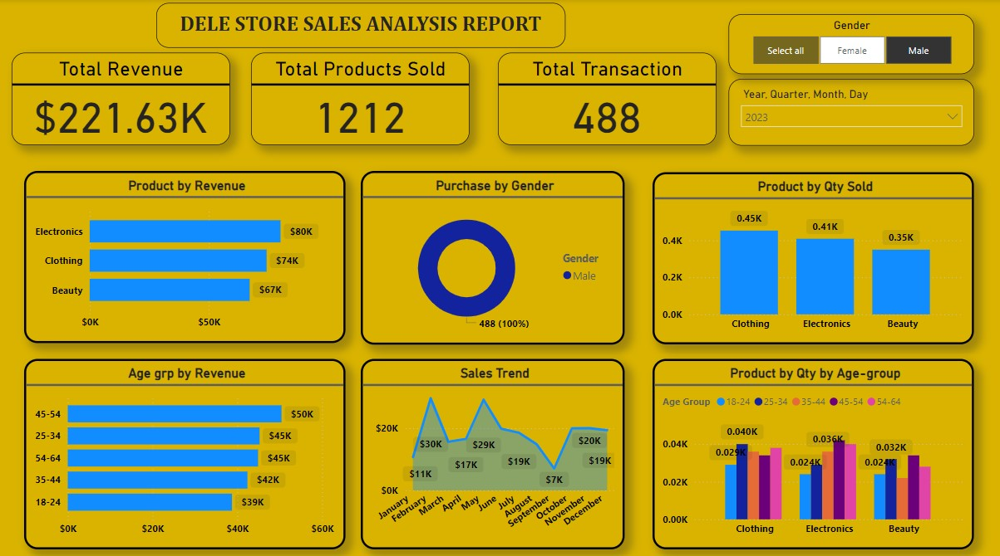
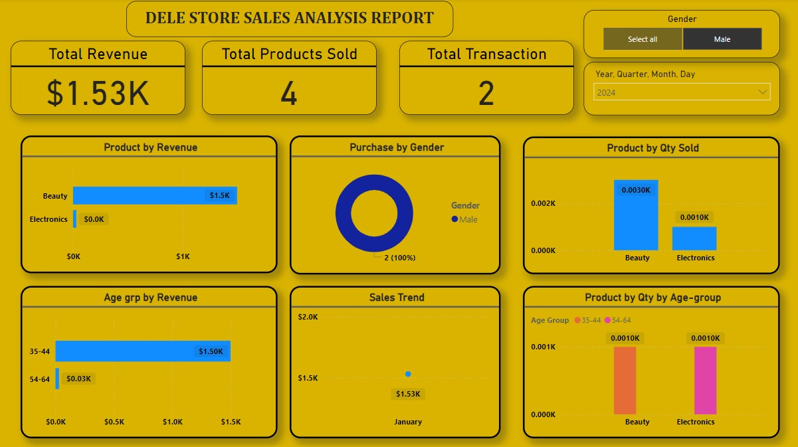

Dele Store Sales Analysis

---

## Introduction 
This is a data visualisation project on an imaginary store called **Dele Stores**. The task is to provide a detailed overview of the sales performance, customer demographics, and product category analysis for the specified period. The dashboard presents key metrics including total revenue, total products sold, and total transactions. Additional insights into revenue distribution by product category, gender, age group, and monthly sales trends are also highlighted. 

**_Disclaimer_** : _All datasets and reports do not represent any company, institution or country, but just a dataset to demonstrate capabilities of Data Visualisation._

##Problem Statement
The primary goal of this report is to understand the sales performance and customer purchasing behavior at Dele Store. The aim is to identify the top-performing products, key customer segments, and seasonal trends to inform strategic decisions for marketing, inventory management, and sales optimization.

## Excel & Power BI Concepts Applied:
The following features were incorporated:
- Nested IFs to categorise the age data into groups **=IF(E2>54,"54-64",IF(E2>44,"45-54",IF(E2>34,"35-44",IF(E2>24,"25-34","18-24"))))**
- Excel Pivot 
- Filters
- Visualisation in Power BI

## Data Sourcing
After assessing the problem statement above, I went ahead to extract the data from its source (Kaggle) in CSV file into Excel to check the quality of the data including completeness, validity, and accuracy.

It contains a table with 1000 rows and 9 columns

## Data Transformation/Cleaning

Data was efficiently cleaned using the Excel. (A screenshot of the applied steps). Some of the applied steps included:

Making the first row as headers in the table
Analytic transformation of the table; to create new column (age group such as **=IF(E2>54,"54-64",IF(E2>44,"45-54",IF(E2>34,"35-44",IF(E2>24,"25-34","18-24"))))**
Data type changed from 'TEXT' to 'WHOLE NUMBER', 'WHOLE NUMBER' to 'CURRENCY'

## Data Analysis & Visuals

The dashboard shows that Dele Store generated a total revenue of $456,000 from 2,514 products sold across 1,000 transactions. When we break down the revenue by product category, electronics lead slightly with $157,000, closely followed by clothing at $156,000, and beauty products at $144,000. Interestingly, although electronics bring in the highest revenue, clothing tops the quantity sold with 890 units, compared to 850 units of electronics and 770 units of beauty products.

Examining customer demographics reveals that purchases are almost evenly split between genders, with males making 51% of the purchases and females accounting for 49%. This near-equal split indicates that Dele Store appeals equally to both men and women. Additionally, the age group analysis highlights that customers aged 25-54 are the most significant contributors to revenue. Each of the age brackets 25-34, 35-44, and 45-54 generates $97,000 in revenue, while the 55-64 age group contributes $90,000, and the youngest group, 18-24, brings in $75,000.

The sales trend over the year shows fluctuating revenue, with notable peaks in April and December. April stands out with the highest monthly revenue of $53,000, followed by strong performances in October and November, each bringing in $47,000, and December at $45,000. This pattern suggests that seasonal factors, possibly holiday shopping, significantly boost sales during these months.

### Using the Slicer Feature 
2023         |     2024
:-------------------------:|:---------------------------:
          |   

In 2023, Dele Store generated a total revenue of $221,630 from male customers, who made up the entire customer base for this analysis period. These male customers purchased a total of 1,212 products through 488 transactions. Breaking down the revenue by product category, electronics led the way with $80,000, followed by clothing with $74,000, and beauty products with $67,000. Although electronics brought in the highest revenue, clothing had the highest number of units sold at 450, compared to 410 units of electronics and 350 units of beauty products.

Analyzing the age demographics of male customers, the 45-54 age group was the highest contributor to revenue, generating $50,000. The 25-34 and 54-64 age groups each contributed $45,000, while the 35-44 age group generated $42,000, and the youngest age group, 18-24, brought in $39,000. This indicates a relatively balanced contribution across different age segments, with a slight edge for the middle-aged groups.

The monthly sales trend for male customers showed significant fluctuations throughout the year. The highest sales were recorded in January at $30,000, followed by another peak in March at $29,000. The lowest sales month was October with $7,000. However, there was a notable recovery towards the end of the year, with December seeing sales of $19,000. This pattern suggests potential seasonal influences and possibly successful promotional activities during the start and end of the year.

## Conclusion
The analysis indicates that Dele Store has a balanced sales performance across different product categories, with electronics slightly ahead in revenue. The customer base is evenly split between male and female purchasers. The age group of 25-54 years is the highest revenue-generating segment. Significant sales spikes in April and the latter part of the year highlight seasonal influences on purchasing behavior.

## Recommendations

1. Targeted Marketing: Focus marketing efforts on the 25-54 age group, as they contribute the most to revenue. Gender-specific campaigns can be designed to equally attract both male and female customers.
2. Product Strategy: Ensure a robust inventory for electronics and clothing, given their high sales volume and revenue. Consider exploring new product lines or expanding the current offerings in these categories.
3. Promotional Activities: Plan promotions and discounts around peak months like April and December to capitalize on increased customer spending during these periods.
4. Customer Engagement: Develop loyalty programs and personalized marketing strategies to retain high-value customers in the 25-54 age group.
